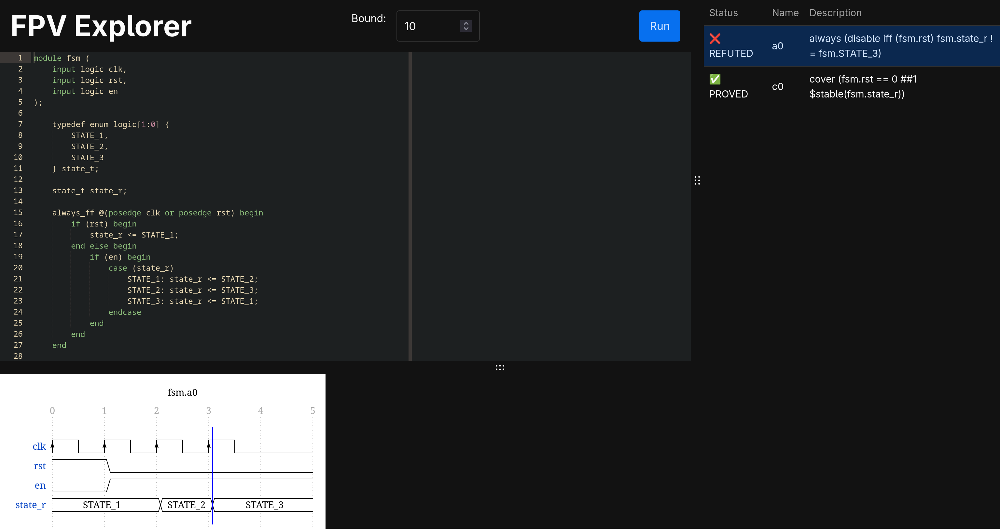

# FPV Explorer



FPV Explorer is a web application for playing with the formal verification of digital circuits,
based upon [EBMC for the web](https://www.cprover.org/ebmc/web/). It runs entirely in the browser
and can be statically hosted. FPV Explorer is built upon the following awesome open source projects:

- [Svelte](https://svelte.dev/) and [SkeletonUI](https://www.skeleton.dev/) for the frontend
- [EBMC](https://www.cprover.org/ebmc/) for the formal verification
- [Ace](https://ace.c9.io/) for the code editor
- [WaveDrom](https://wavedrom.com/) for drawing the simulation traces
- [OpenMoji](https://openmoji.org/) for the site's favicon

## Get Started
If you want to try out FPV Explorer for yourself, it is currently hosted at
[my UF static hosting](https://cise.ufl.edu/~mhershfield/fpv-explorer/). This may be migrated to
GitHub Pages in the future.

If you want to build/host FPV Explorer yourself, you just need NPM.
```sh
npm i
npm run build
cp -r dist/* your_public_html/
```

## Current Bugs and Limitations
The original version of FPV explorer was thrown together in a weekend for a workshop teaching
high schoolers about formal verification. As such, it is in its MVP phase and has many limitations:
- If your design has a clock, it must be called `clk`
- All designs must have an active-high reset signal `rst` even if it is not used, or else FPV will not run
- All signals that start with an `_` or an uppercase letter are hidden on the simulation trace
- EBMC's parsing of SystemVerilog and its solving of assertions can be finicky, crashes and error
    output is not handled gracefully or displayed to the user
- Changing the zoom on the site can cause UI elements to become unviewable
- Some platforms are unable to see the syntax error markers in the ACE editor
